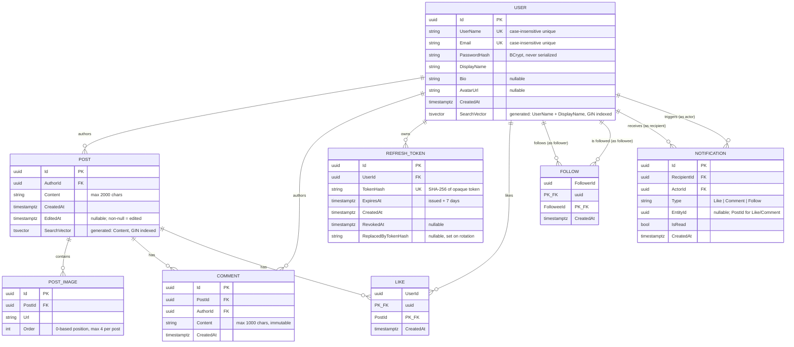

# Database Design — Socialize Backend

Visual reference for the PostgreSQL schema behind the Socialize backend. The authoritative
field-level spec lives in [`specs/001-social-media-backend/data-model.md`](../specs/001-social-media-backend/data-model.md);
this document renders that schema as diagrams.

## Entity-Relationship Diagram



## Notes on the diagram

- **Composite primary keys**: `LIKE (UserId, PostId)` and `FOLLOW (FollowerId, FolloweeId)` have
  no surrogate `Id` — the pair itself is the key, which is what makes "like/follow twice" naturally
  impossible at the database level rather than needing application-level de-duplication.
- **Self-referencing relationships on `USER`**: `FOLLOW` and `NOTIFICATION` each have *two* foreign
  keys into `USER` (follower/followee, recipient/actor). Both are drawn as separate relationship
  lines above since one row always involves two different users.
- **`SearchVector`** is a Postgres-only generated column (`tsvector`, GIN-indexed) added purely at
  the EF Core configuration layer — it does not exist as a C# property on the `User`/`Post` domain
  classes, keeping the Domain project free of any Postgres-specific type.

## Cascade / delete-behavior reference

Mermaid's ER notation doesn't encode `ON DELETE` behavior, so it's captured here instead:

| Relationship | On delete of parent | Rationale |
|---|---|---|
| `Post → PostImage` | **Cascade** | Images have no meaning without their post |
| `Post → Comment` | **Cascade** | Comments have no meaning without their post |
| `Post → Like` | **Cascade** | Likes have no meaning without their post |
| `User → Post` (author) | **Restrict** | No delete-account endpoint exists; avoids surprise mass-deletes |
| `User → Comment` (author) | **Restrict** | Same reasoning; also avoids EF Core's multiple-cascade-path error via `Post` |
| `User → RefreshToken` | **Cascade** | Tokens are meaningless without their owning user |
| `User → Like` (liker) | **Restrict** | Avoids a second cascade path into `Like` alongside `Post → Like` |
| `User → Follow` (either side) | **Restrict** | Avoids a cascade path colliding with the composite key's dual FK |
| `User → Notification` (either side) | **Restrict** | Same reasoning as `Follow` |

Deleting a post's **files on disk** (the images referenced by `PostImage.Url`) is *not* something
the database does — the `DeletePost` command handler removes them explicitly via `IFileStorage`
before the DB cascade runs, since orphaned files aren't a database-level concern.

## Notification event flow

The three actions that create a `Notification` also push it live over SignalR — this sequence
shows the actual code path (persist-then-push, and the self-action skip) rather than just the schema:

```mermaid
sequenceDiagram
    actor Actor as Actor (Bob)
    participant API as API Handler<br/>(Like / Comment / Follow)
    participant DB as PostgreSQL
    participant Hub as SignalR Hub
    actor Recipient as Recipient (Alice)

    Actor->>API: POST /posts/{id}/like
    API->>DB: Insert Like row
    alt Actor is NOT the post's author
        API->>DB: Insert Notification row
        API->>Hub: PublishAsync(recipientId, notification)
        Hub-->>Recipient: "ReceiveNotification" (if connected)
    else Actor IS the post's author (self-like)
        API-->>API: Skip notification entirely
    end
    API-->>Actor: 204 No Content
    Recipient->>API: GET /notifications (persisted regardless of live delivery)
```

## Full request shape reference

For the HTTP contract that sits on top of this schema (endpoints, request/response JSON,
pagination envelopes, error shapes), see [`API.md`](./API.md) and
[`specs/001-social-media-backend/contracts/openapi.yaml`](../specs/001-social-media-backend/contracts/openapi.yaml).
